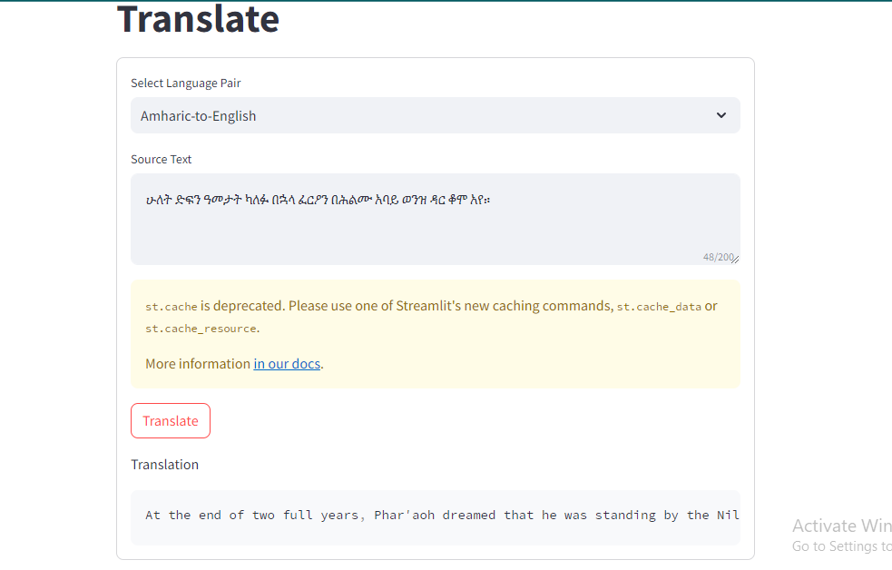

# English/Amharic Translator
Machine Translation (MT) Web Interface with OpenNMT and FairSeq models using *CTranslate* and *Streamlit*.


## Install requirements

It is recommended you first create a virtual environment, and then run:

```
pip3 install -r requirements.txt
```


## Running the App

With [translate.py](translate.py) or [translate-multi.py](advanced/translate-multi.py), you can run a fast web translator using CTranslate2. For this  to work, you have to change the paths to your models; search the code for [Modify] and adjust the following lines.


## Training And Data Preparation
* Dataset Preparation and Processing ([notebook](https://colab.research.google.com/drive/1pXa7TpQ87xtlY1htkq3oANU5zlXky1Ll?usp=sharing#scrollTo=2KjicHTBWlt9))
* Training and Streamlit Interface ([notebook](https://colab.research.google.com/drive/1hBv_2f6DEXDDQxKvW4JWxVoR6nScNVlY?usp=sharing))


